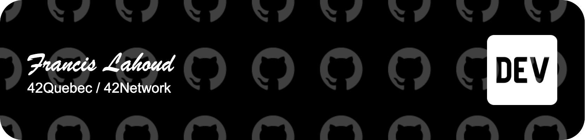

# Hi there, I'm Francis Lahoud!

# About Me
I'm a junior developer currently completing the common core at 42Quebec, part of the 42Network.

This is my personal page for school projects. I am currently contributing most of my free time into an ongoig project where I try to put everything I've learned together to produce a yet to see result.

You can follow my progress on the github organization I've created: [SimpleOpenSource](https://github.com/SimpleOpenSource)

# Skills
- Programming languages: C, C++, rust, java/type-script, python, SQL
- Frameworks: Vue.js, React, Jekyll, Hugo
- SaaS: Appsheet, PowerBI, Microsoft Fabric

# Learning
- Programming languages: Rust, Go, Python
- Framework: Rocket.rs
- Linux Kernel

# Contact Me
If you'd like to get in touch, feel free to reach out to me on [LinkedIn](https://www.linkedin.com/in/francis-lah) or via email at flahoud@student.42quebec.com.
